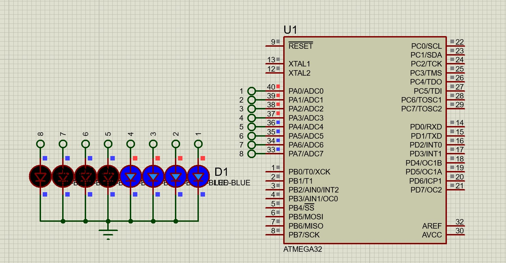

 

# صورت مسئله

- 8 عدد ال ای دی داریم که می بایست بر اساس عدد باینری 0 تا 256 که یک بایت را تشکیل می دهد شمارنده باشد و به شکل باینری بشمرد به بالا برود 

<a href="./8LED.mp4" > ویدئو 

https://github.com/user-attachments/assets/397e9083-3eaa-4251-8cb2-00efe48f741b

