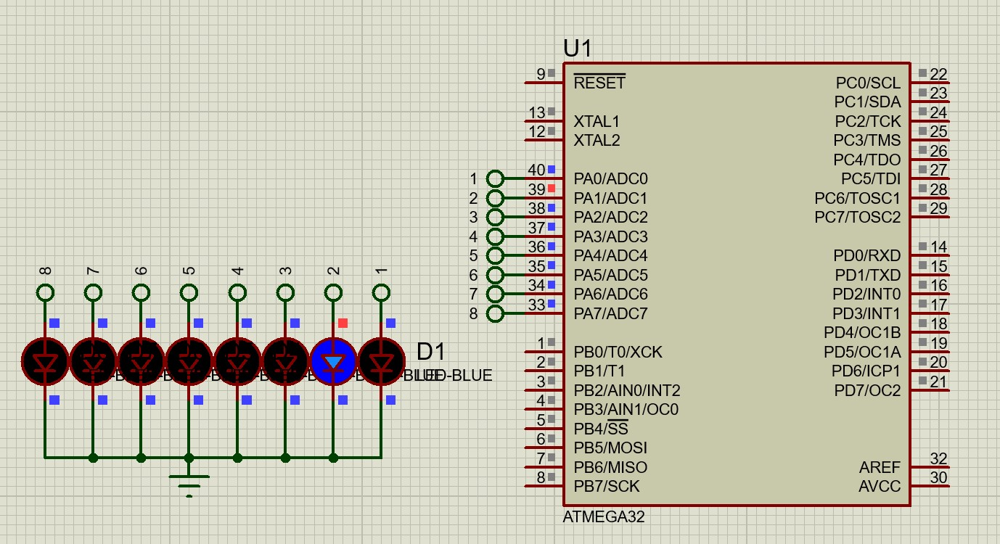

 

# صورت مسئله

-  8 عدد ال ای دی داریم که می بایست از سمت راست به چپ چشمک بزنند و همینطور بعد از یک دور چشمک زدن برگردد از سمت چپ به راست

<a href="./8LED_toggle.mp4" > ویدئو 

https://github.com/user-attachments/assets/58c8994c-cfac-4dad-91df-c179948c8e25

