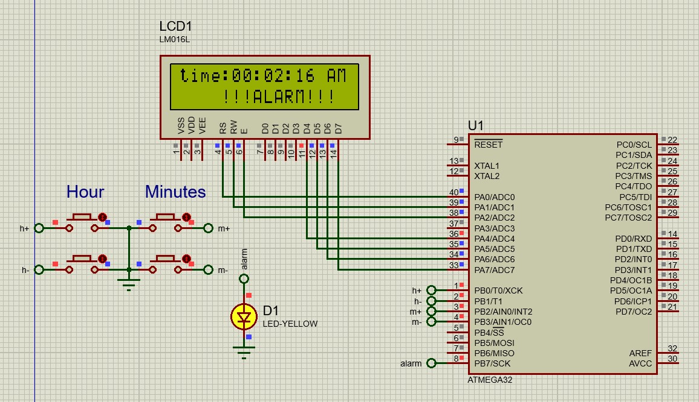

 

# صورت مسئله

- طراحی یک ساعت با استفاده از تایمر 2 میلی ثانیه
- با استفاده از دکمه های روبرو بتوان میزان ساعت و دقیقه آن را تنظیم نمود 
- دارای یک آلارم و تنظیم آن و روشن شدن LED و خاموش شدن آن بعد از گذشت زمان 5 ثانیه _این ویژگی باید توسط تایمر زده شود اما در این کد روش ساده تری انجام شده است_
- تعیین حالت am/pm  و ساعت 12ساعته 

<a href="./Clock.mp4" > ویدئو</a>

 <video width="320" height="240" controls align="center">
  <source src="/Clock.mp4" type="video/mp4">
  Your browser does not support the video tag.
</video> 

