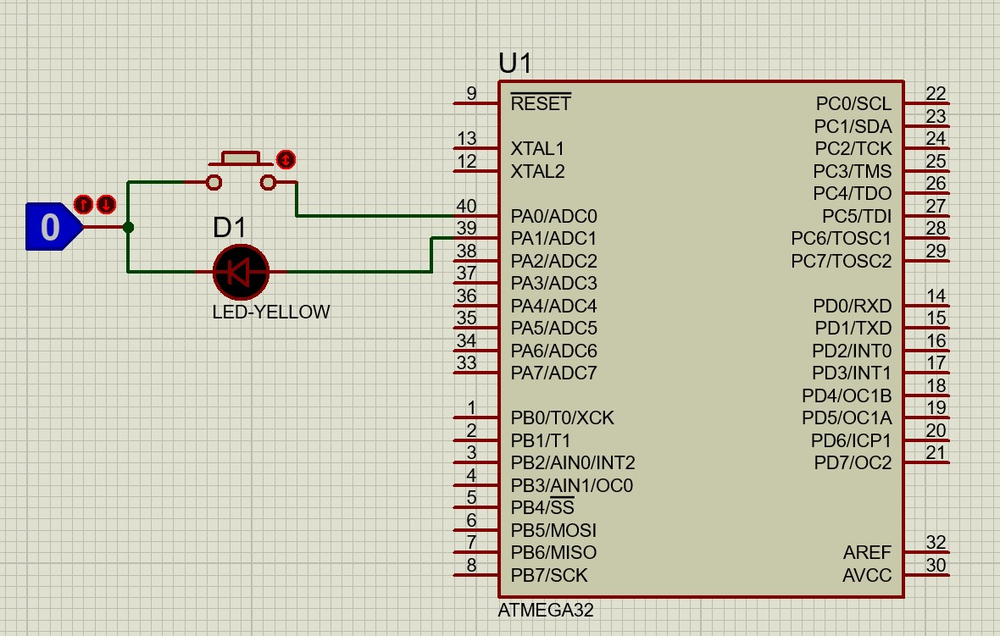

 

# صورت مسئله

- با استفاده از یک پوش باتن که به صورت داخلی داخل میکرو پول آپ شده یک ال ای دی را روشن کنید
- با استفاده از همون پوش باتن ال ای دی را خاموش کنید.
- حالت toggle  می بایست با استفاده از نات کردن وضعیت قبلی صورت می گیرد.

<a href="./LED_Button_toggle.mp4" > ویدئو 

