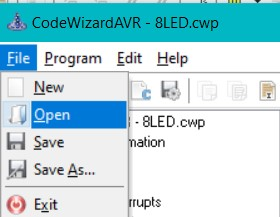

# آزمایشگاه میکروکامپیوتر 2

پروژه های که در قالب تکلیف سر کلاس داده  می شود در اینجا شبیه سازی می شوند.

> [با استفاده از یک پوش باتن یک LED را خاموش و روشن کنید .](./LED_Button_toggle/)

> [شمارنده 0 تا 255 با استتفاده از 8 عدد LED ](./8LED/)

> [8 عدد LED که به ترتیب چشمک می زنند و در انتها از آخر به اول می آید](./8LED_toggle/)

>  [یک کاراکتر ستاره با 4 عدد پوش باتن بر روی ال سی دی کاراکتری جا به می شود](./lcd) 

> [یک دستگاه شماره گیر بانک که با استفاده از اینتراپت عمل می کند تاریخ1403/08/26](./lcd_interupts/)

> [ اندازه گیری مقدار انالوگ دریافتی از پتانسیومتر با استفاده از قابلیت ADC تاریخ 1403/09/03](./adc/)

> [توضیحات  اولیه مربوط به تایمر ها تاریخ 1403/09/10](./Timer/)

> [پروژه بالا پایین بردن مقدار رجیستر های شمارنده تایمر 0 و نشان دادن آن بر روی ال سی دی - تاریخ1403/09/17](./Timer_lcd/)

> [ساخت یک ساعت با استفاده از ال سی دی و پوش باتن برای تعیین میزان ساعت و دقیقه ی آن -تاریخ 1403/10/8  ](./Clock/)
## دیدن محتویات کد ویزارد

 پسوند فایل تنظیمات کد ویزارد هر پروژه می باشد. **cwp.***

