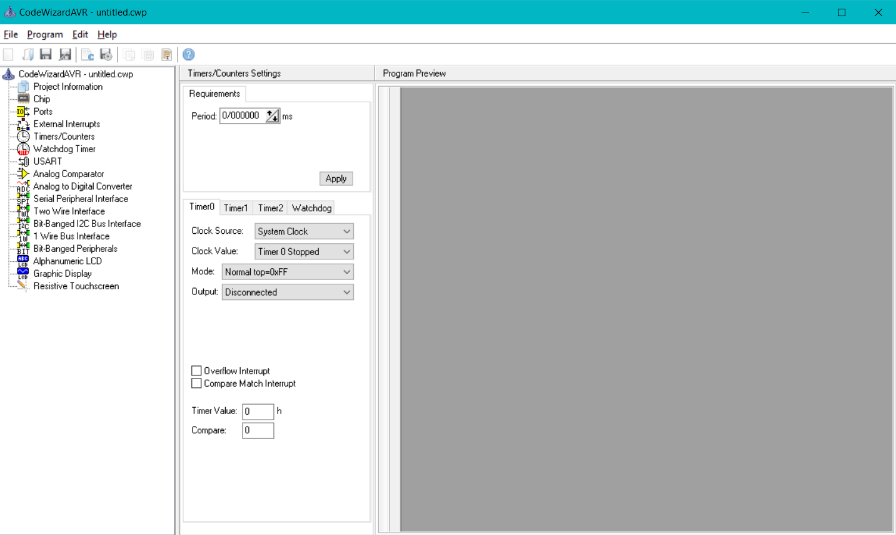
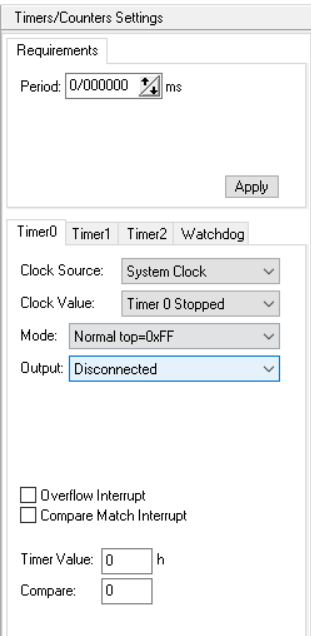
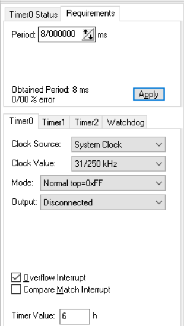
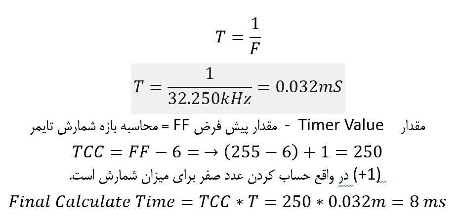
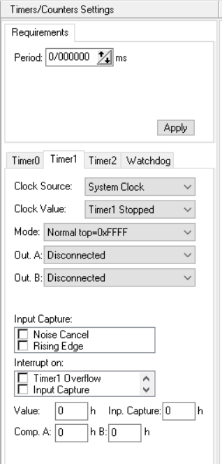

# تایمر ها
در بحث تایمر ها در واقع میکرو های AVR می توان گفت که مدل های مختلفی از آن را در اختیار کابر قرار می دهند برای فعالسازی آنها از منوی timer   قسمت   کد ویزارد می بینیم که میکرو ی ما 3 تایمر  مستقل دارد و تایمر واچ داگز برای ریست کردن میرو در هنگام هنگ کردن  می باشد:
- [timer0](#timer0)
- [timer1](#timer1)
- [timer2](#timer2)

در این تایمرها در واقع چندین پارامتر داریم که می توان گفت با بقیه مشابه هستند 
شما می توانید با اعمال زمانی که برای تایمر خود میخواهید بین بازه مجاز آن که بر اساس فرمولها بدست می ایند به قسمت Period  اعمال کنید و بر روی کلید apply  کلیک کنید در این لحظه کد ویزارد بر اساس مقدار زمان شما فرکانس پالس ساعت و واحد شمارش را تنظیم می کند.

## timer0 
مشابه به یکدیگر هستند این دو تایمر 
## timer2

 
- قسمت clock source    معمولا بر روی گزینه پیش فرض خودش باقی می ماند اما گزینه های دیگر اون می توان بر اساس پایه تایمر 0 بر روی میکرو میتوان یک پالس بالا رونده و یا پایین رونده به میکرو اعمال نمود برای شروع
- قسمت clock value مقدار فرکانس این تایمر را تعیین می کند بر اساس آن می توان واحد شمارش را تغییر داد 
- بخش mode  در واقع میزان واحد استاندارد بیشینه شمارش را تعیین می کند که به صورت پیش فرض بر روی مقدار هگزا دسیمال FF قرار گرفته است به معنای عدد 255 
- بخش output  فعلا خالی باقی می ماند
- تیک قسمت overflow interupt  در واقع با رسیدن شمارش به حد ماکسیمم خود یک وقفه دریافت می کنیم
- compare match interupt در واقع مربوط به بخش مقایسه کردن با مقدار وارد شده در تایمر است
- timer value مقدار عدد شمارش که بر اساس هگزادسیمال قرار می گیرد
  

### مثال تایمر
در ادامه نحوه ی محاسبه رو توضیح می دهیم به عکس اگر دقت کنید برای یک زمان 8 میلی ثانیه ای تنظیمات زیر برای ما اعمال می گردد

اگر بخواهیم نحوه محاسبه را شرح دهیم باید گفت ابتدا نیاز به مقدار زمان تناوب داریم که با استفاده از فرمول زیر محاسبه می شود و بعد از به دست آورزدن میزان واحد شمارش و ضرب آن در زمان تناوب مقدار تایمر بدست می آید.

## timer1
 این تایمر تنظیمات بیشتری نسبت به دو تایمر دیگر دارد .

