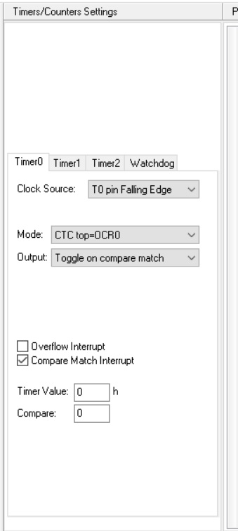
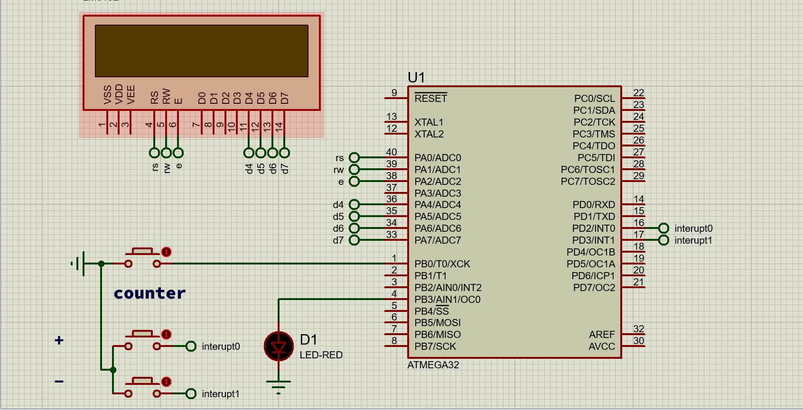

 

# صورت مسئله

- با استفاده از تایمر ها از تایمر 0 می بایستی که آن را مطابق [شکل](#عکس-تنظیمات-تایمر-0) تنظیم نماییم و سپس با استفاده از دو کلید وقفه اینترآپت دار مقدار رجیستر OCR0 که در واقع همان رجیستر شمارنده پایانی تایمر صفر می باشد کم و زیاد کنیم همچنین باید در صورتی که مقدار رجیسستر پایانی از شمارنده اولیه کمتر شد مقدار آنها را به نوعی با یکدیگر یکسان سازی کنیم .
## عکس تنظیمات تایمر 0

## عکس پروژه در نرم افزار

<a href="./Timer_lcd.mp4" > ویدئو 

