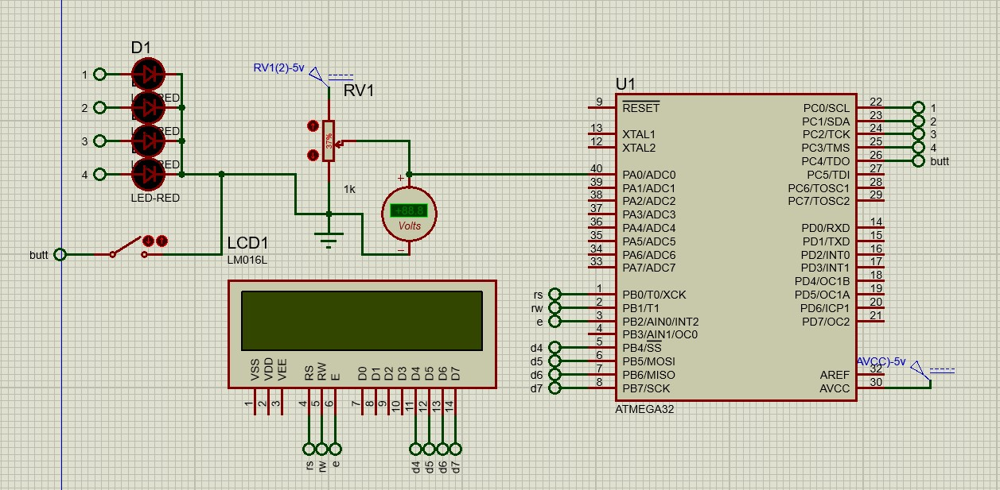

 

# صورت مسئله

- خواندن یک مقدار آنالوگ ایجاد شده توسط یک پتانسیومتر و تبدیل آن به مقدار دیجیتال توسط کانال adc 
- نشان دادن مقدار تبدیل شده به ولتاژ بر روی ال سی دی کاراکتری
- قرار دادن یک کلید برای تبدیل مقدار ولتاژ خوانده شده به درصد
- نشان دادن همچنین مقدار درصد با استفاده از 4 ال ای ی به تناسب *0-25* و *26-50* و *51-75* و *76-100*

<a href="./adc.mp4" > ویدئو 

