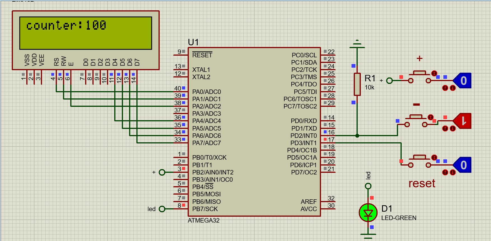

 

# صورت مسئله

- یک سیستم بانک که قراره شمارنده داشته باشه که با استفاده از 3 تا کلید که هر سه اینترآپت و وقفه در نظر گرفته شدند کار کند 
- یک کلید افزایش بده مقدار را از 100 به بالا که مد کاری این پوش باتن می بایستی falling edge  باشد
- یک کلید برای کاهش مقدار شمارنده که مد کاری این پوش باتن می بایستی از نوع rising edge  باشد بر همین منظور با یک مقاومت به زمین پول داون می گردد
- کلید آخر ریست مقدار هستش که در داخل کد رجیستر وقفه ی ان باید بر روی حالت Low تعریف شده باشد
همچنین یک ال ای دی به صورت چشمک زن در 2 ثاینه روشن و خاموش می شود و وقت میکرو را برای 4 ثانیه در مجموع می گیرد.

<a href="./lcd_interupts.mp4" > ویدئو 

https://github.com/user-attachments/assets/352c32a4-8420-4474-a57f-5429008bac3a

